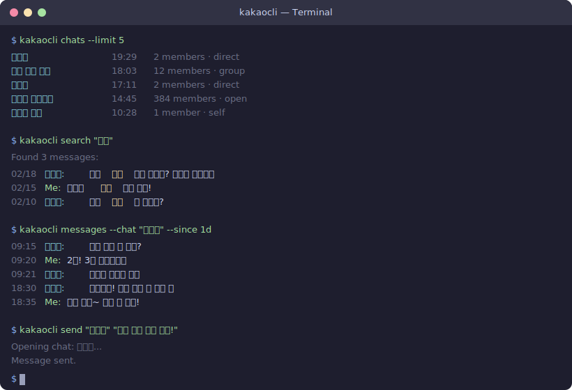

# kakaocli

CLI toolkit for KakaoTalk on macOS. It reads the local SQLCipher database in read-only mode, automates the native app when needed, and includes a local Live RAG stack for evidence-backed retrieval.

macOS용 카카오톡 CLI 툴킷입니다. 로컬 SQLCipher DB를 읽기 전용으로 다루고, 필요할 때 네이티브 앱을 자동화하며, 근거 기반 검색을 위한 로컬 Live RAG 도구를 함께 제공합니다.

<p align="center">
  
</p>

> [!NOTE]
> This project does not call Kakao APIs or reimplement the KakaoTalk protocol. It works against data already stored on your Mac.

## Overview

`kakaocli` covers two workflows:

- Core CLI: inspect chats, search messages, query the local database, and automate send/login/harvest flows.
- Live RAG: keep a local retrieval store and query it through `./bin/query-kakao`.

The repo root is the product root. The main entrypoints are:

- `./bin/install-kakaocli`
- `./bin/kakaocli-local`
- `./bin/query-kakao`

## Quick Start

### 1. Install dependencies and build

```bash
./bin/install-kakaocli
```

This script:

- ensures `sqlcipher` is installed with Homebrew
- builds `.build/release/kakaocli`
- prepares a repo-local `.venv` for the Live RAG helpers
- runs a small local verification pass unless `--build-only` is used

### 2. Grant macOS permissions

Grant these permissions to the terminal app you use:

- Full Disk Access: required to read KakaoTalk's encrypted local database
- Accessibility: required for UI automation commands such as `send`, `harvest`, and `inspect`

### 3. Verify local access

```bash
./bin/kakaocli-local status
./bin/kakaocli-local auth
./bin/kakaocli-local chats --limit 10
```

If `auth` succeeds, read-only commands are ready to use.

### 4. Run common commands

```bash
./bin/kakaocli-local search "점심"
./bin/kakaocli-local messages --chat "지수" --since 7d
./bin/kakaocli-local send --me _ "test message"
./bin/kakaocli-local sync --follow
./bin/kakaocli-local query "SELECT COUNT(*) FROM NTChatMessage"
```

Use `--me` when testing send flows.

## Core CLI

### Read commands

| Command | Description |
|---------|-------------|
| `./bin/kakaocli-local status` | Check app installation and local permissions |
| `./bin/kakaocli-local auth` | Verify database decryption |
| `./bin/kakaocli-local chats` | List chats by recent activity |
| `./bin/kakaocli-local messages --chat "name"` | Read messages from a chat |
| `./bin/kakaocli-local search "keyword"` | Search across all messages |
| `./bin/kakaocli-local schema` | Dump the raw DB schema |
| `./bin/kakaocli-local query "SQL"` | Run read-only SQL against the local DB |

All read commands support `--json`.

### Login

`kakaocli login`은 macOS Keychain에 자격증명을 저장하고, KakaoTalk 앱을 실행하여 실제 로그인까지 자동으로 수행합니다.

`.env` 파일에 자격증명을 미리 설정해 두면 테스트 스크립트에서 활용할 수 있습니다:

```bash
cp .env.example .env
```

`.env` 예시:

```dotenv
# KakaoTalk login credentials (used by `kakaocli login`)
ID=your-email@example.com
PASSWORD=your-password
```

#### 명령어 옵션

```bash
# 자격증명 저장 + 앱 실행 + 로그인 (인터랙티브 프롬프트)
./bin/kakaocli-local login

# 이메일/비밀번호를 직접 지정하여 로그인
./bin/kakaocli-local login --email user@example.com --password mypass

# 자격증명 저장만 (로그인 시도 안 함)
./bin/kakaocli-local login --save-only

# 로그인 상태 확인
./bin/kakaocli-local login --status

# 저장된 자격증명 삭제
./bin/kakaocli-local login --clear
```

#### 동작 매트릭스

| 시나리오 | 동작 |
|---------|------|
| `login` (자격증명 없음) | 프롬프트 → Keychain 저장 → 앱 실행 → 로그인 |
| `login` (자격증명 있음) | 저장된 자격증명으로 바로 로그인 시도 |
| `login --email x --password y` | Keychain 저장 → 로그인 |
| `login --save-only` | 프롬프트 → Keychain 저장만 |
| `login --status` | 자격증명 저장 여부 + 앱 상태 출력 |
| `login --clear` | Keychain에서 자격증명 삭제 |
| 이미 로그인됨 | "Already logged in" 출력, 성공 종료 |

### Write and automation commands

| Command | Description |
|---------|-------------|
| `./bin/kakaocli-local send "name" "msg"` | Send a message via UI automation |
| `./bin/kakaocli-local sync --follow` | Watch for new messages in real time (NDJSON) |
| `./bin/kakaocli-local harvest` | Capture chat names and load message history from UI |
| `./bin/kakaocli-local inspect` | Dump KakaoTalk UI element tree (for debugging) |

`send`, `sync`, and `harvest` will launch KakaoTalk and use stored credentials when required.

### Sync

`sync`는 로컬 DB를 폴링하여 새 메시지를 실시간으로 감지하고, NDJSON 형식으로 출력합니다.

```bash
# 현재 high-water mark 확인 (one-shot)
./bin/kakaocli-local sync

# 실시간 메시지 감시 (Ctrl-C로 중지)
./bin/kakaocli-local sync --follow

# 웹훅으로 새 메시지 전송
./bin/kakaocli-local sync --follow --webhook https://example.com/hook

# 폴링 간격 및 시작 지점 지정
./bin/kakaocli-local sync --follow --interval 5 --since-log-id 123456
```

| Option | Default | Description |
|--------|---------|-------------|
| `--follow` | off | 지속적으로 새 메시지를 감시 (NDJSON 출력) |
| `--webhook URL` | – | 새 메시지를 지정한 URL로 POST |
| `--interval N` | 2 | 폴링 간격 (초) |
| `--since-log-id N` | latest | 이 logId 이후의 메시지부터 시작 |

### Harvest

`harvest`는 KakaoTalk UI의 채팅 목록에서 표시 이름을 캡처하여 `~/.kakaocli/metadata.json`에 저장합니다. `--scroll` 옵션으로 채팅을 열어 이전 메시지 히스토리를 로딩할 수도 있습니다.

```bash
# 채팅 이름만 캡처
./bin/kakaocli-local harvest

# 최근 20개 채팅만 처리
./bin/kakaocli-local harvest --top 20

# 채팅을 열어 이전 메시지까지 로딩
./bin/kakaocli-local harvest --scroll --max-clicks 15

# 실행 전 미리보기
./bin/kakaocli-local harvest --dry-run
```

| Option | Default | Description |
|--------|---------|-------------|
| `--top N` | all | 최근 N개 채팅만 처리 |
| `--scroll` | off | 채팅을 열어 "이전 대화 보기" 클릭으로 히스토리 로딩 |
| `--max-clicks N` | 10 | 채팅당 최대 "이전 대화 보기" 클릭 횟수 |
| `--scroll-delay N` | 1.5 | 액션 간 대기 시간 (초) |
| `--dry-run` | off | 실행하지 않고 처리 대상만 표시 |

### Inspect

`inspect`는 KakaoTalk의 UI 요소 트리를 덤프합니다. 자동화 명령(send, harvest 등)을 디버깅할 때 유용합니다.

```bash
# 전체 UI 트리 덤프
./bin/kakaocli-local inspect

# 탐색 깊이 제한
./bin/kakaocli-local inspect --depth 3

# 특정 채팅을 열어 해당 창 UI 트리 덤프
./bin/kakaocli-local inspect --open-chat "지수"
```

| Option | Default | Description |
|--------|---------|-------------|
| `--depth N` | 5 | 최대 트리 탐색 깊이 |
| `--open-chat "name"` | – | 지정한 채팅을 열고 해당 창을 덤프 |

## Live RAG

The local retrieval store lives at `.data/live_rag.sqlite3`. It keeps canonical message rows plus semantic sidecar data used by the retrieval service.

### Query the store

```bash
./bin/query-kakao --json --query-text "박다훈 업데이트"
./bin/query-kakao --json --mode lexical --query-text "업데이트"
./bin/query-kakao --json --mode semantic --query-text "회의가 연기된 내용"
./bin/query-kakao --json --mode hybrid --query-text "박다훈이 미룬 일정"
```

Supported retrieval modes:

- `lexical`: exact and keyword-oriented matching
- `semantic`: embedding-based similarity search
- `hybrid`: merged lexical + semantic ranking

When semantic retrieval is unavailable, `hybrid` falls back to lexical and reports the fallback in JSON.

### Build, update, and validate semantic data

Create a local `.env` file first if you plan to build embeddings or run semantic retrieval through the background service:

```bash
cp .env.example .env
```

Set `HF_TOKEN` in `.env`, then run:

```bash
conda run -n module python tools/live_rag/build_semantic_index.py --mode update
conda run -n module python tools/live_rag/build_semantic_index.py --mode rebuild --batch-size 20 --progress
conda run -n module python tools/live_rag/validate_semantic.py --use-temp-db --backend huggingface
```

The current policy indexes normal text messages from chats whose `member_count` is `<= 30`, unless explicitly overridden in `configs/live_rag_semantic_policy.yaml`.

Direct shell environment variables still work and take precedence over `.env`.

### Background service

`./bin/query-kakao` uses the launchd-backed Live RAG service. Service management commands are available through:

```bash
conda run -n module python tools/live_rag/service_manager.py status
conda run -n module python tools/live_rag/service_manager.py ensure
conda run -n module python tools/live_rag/service_manager.py start
conda run -n module python tools/live_rag/service_manager.py stop
```

The default launchd label is `io.rukkha.kakaocli-live-rag`.

## AI Integration

The CLI and Live RAG query path both emit structured JSON, so local scripts, editors, or custom agents can consume them directly.

Examples:

```bash
./bin/kakaocli-local chats --json
./bin/kakaocli-local messages --chat "name" --since 1d --json
./bin/query-kakao --json --query-text "이번 주 회의 일정"
```

Use explicit user confirmation before sending messages to other people.

## Limitations

- macOS only
- KakaoTalk Mac sync history is incomplete until a chat has been opened on that Mac
- group chat display names may remain `(unknown)` until `harvest` captures them from the UI
- media and non-text messages are not fully rendered yet
- KakaoTalk allows one logged-in Mac per account

## Disclaimer

> This project is not affiliated with Kakao Corp.
>
> It reads KakaoTalk data already stored on your Mac and automates the native app through standard macOS Accessibility APIs.
>
> It does not call Kakao APIs, reimplement the KakaoTalk protocol, or modify the KakaoTalk application.

## Credits

Developed by **[Brian ByungHyun Shin](https://github.com/brianshin22)** at **[Silver Flight Group](https://github.com/silver-flight-group)**.

Database decryption approach based on research by [blluv](https://gist.github.com/blluv/8418e3ef4f4aa86004657ea524f2de14).

Inspired by [wacli](https://github.com/steipete/wacli) by Peter Steinberger.
